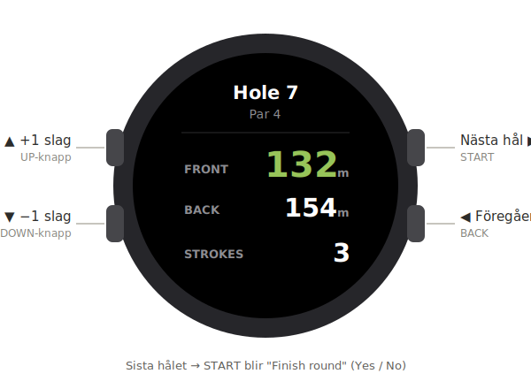

# GolfTrainer — Garmin companion (plan)

A Garmin **Connect IQ** version of the in-round play view, as a companion to the
same backend the Apple Watch app uses. This folder holds the plan and design;
no Monkey C code yet.

> Why Garmin: huge in golf, and for an **internal demo** a sideloaded app stays
> on the watch **permanently and for free** (no 7-day expiry like Apple's free
> account, no store needed). See "Distribution" below.

## Play view (button-driven)

Garmin has **no Digital Crown** — input is physical buttons (and touch on some
models). The stroke counter maps to the **UP / DOWN** buttons; navigation maps
to **START / BACK**.



| Apple Watch | Garmin |
|-------------|--------|
| Crown up / down → ±1 stroke | **UP / DOWN** buttons → ±1 stroke (or on-screen ± on touch models) |
| "Next Hole" button | **START** → next hole |
| "‹" back button | **BACK** → previous hole |
| "Finish Round" (last hole) | **START** on the last hole → "Finish round? Yes/No" |
| Scorecard sheet | Scrollable list (UP/DOWN), then "New round" |
| Standby / "Ingen aktiv runda" | Same placeholder, waiting for a round started on the phone/web |

Screen is **round** (most Garmins) → layout is centered and must fit a circle;
this differs from the Apple Watch rounded-rectangle layout.

## Architecture

The backend is **100% reused** — a Garmin app is a thin client over the same
REST API. Nothing server-side changes.

```
Garmin watch (Monkey C / Connect IQ)
        │  HTTPS + Bearer token (Comm/JSON)
        ▼
Existing backend  (/api/v1)
  GET   /rounds/active                         current hole, par, front/back, holeCount
  PATCH /rounds/:id/holes/:n/strokes           set strokes
  POST  /rounds/:id/next-hole | /prev-hole     navigate
  GET   /rounds/:id/scorecard                  end-of-round table
  PATCH /rounds/:id  {status:"COMPLETED"}      finish
  POST  /auth/watch/pair/start | /poll | /claim  device-code pairing
  POST  /auth/refresh                          token refresh
```

### Pairing & auth (same flow as Apple Watch)
- Watch shows a code (`/pair/start`) and polls (`/pair/poll`).
- User enters the code in the web app (`/pair/claim`) → watch gets tokens.
- Store tokens on-device; refresh access token via `/auth/refresh`.
- Connect IQ note: secure storage via `Storage`/`Application.Properties`;
  network via `Communications.makeWebRequest`.

### GPS / distances
- Garmin sport watches expose position via `Position` (Activity/GPS). Compute
  distance to `greenFront` / `greenBack` returned by the backend — same maths as
  the watchOS app (`CLLocation.distance` → equivalent haversine in Monkey C).

## Target devices (first pass)

Connect IQ devices relevant to golf (declare in `manifest.xml`):
- **Approach** (S-series golf watches), **Forerunner**, **Fenix**, **Epix**,
  **Venu**, **Vivoactive**, **Marq**.
- Pick a sensible **minimum Connect IQ / API level**; handle round screen sizes
  and **button vs touch** input. Not every old/basic model is supported.

## Distribution

- **Internal demo (recommended):** build once → produce a `.prg`/`.iq` →
  **sideload** by copying it to `GARMIN/APPS/` over USB. It stays on the watch
  permanently, free, no store, no expiry.
- **Later / public:** publish to the **Connect IQ Store** (free); users install
  via Garmin Connect Mobile.

## Dev setup (when we start coding)

- Install the **Connect IQ SDK** + **Monkey C** toolchain.
- VS Code **Monkey C extension** (or Garmin's tooling) → build + run in the
  **Connect IQ simulator**, then sideload to a real device.
- Language is **Monkey C** (Garmin-specific) — new code, but mirrors the watchOS
  app's structure (models / API client / view-model / views).

## Status & next steps

- [x] Design + button mapping (this doc + mockup)
- [ ] Confirm target-device list + min API level
- [ ] Scaffold Connect IQ project (manifest, resources, app skeleton)
- [ ] API client (Communications + JSON) + token storage/refresh
- [ ] Pairing screen (show code + poll)
- [ ] Play view (buttons → strokes, next/prev, finish → scorecard)
- [ ] GPS distances
- [ ] Sideload to a real Garmin for the demo

> The Apple Watch app (in `/watch`) is the reference implementation; the backend
> and pairing flow are shared. Finish the Apple Watch pairing + token-refresh
> first, then port the same client logic to Monkey C.
